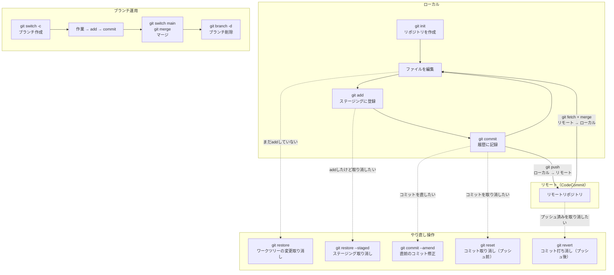

# Gitの基本フロー全体図

## 概要

Gitの基本操作の全体像を1枚にまとめた図です。第9章のまとめおよび講座全体の振り返りで使用します。

## 図



## テキスト版（スライド用）

```
[初期設定]
  git config --global user.name / user.email

[ローカルでの基本サイクル]
  git init → ファイル編集 → git add → git commit
                ↑                        |
                └────────────────────────┘

[リモートとの連携]
  git push          ローカル → リモート
  git fetch + merge リモート → ローカル

[ブランチ運用]
  git switch -c → 作業 → add → commit → git switch main → git merge → git branch -d

[やり直し操作]
  プッシュ前: git restore / git restore --staged / git commit --amend / git reset
  プッシュ後: git revert
```

## 補足

- この図は講座全体の「地図」として、第1章の冒頭で軽く見せ、第9章のまとめで振り返る使い方を想定
- 受講者に「今、全体のどこをやっているか」を意識させるために各章の冒頭で該当部分をハイライトしてもよい
