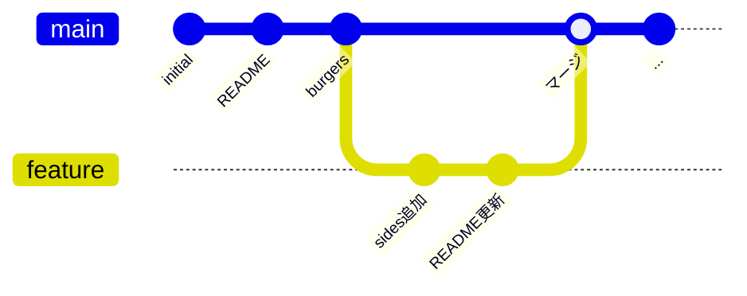

# ブランチの概念図（mainとfeatureの関係）

## 概要

統合ブランチ（main）とトピックブランチ（feature）の関係を示す図です。第4章の導入で使用します。

## 図



## テキスト版（スライド用）

```
main      ──●──●──●─────────────────●──●── (統合ブランチ)
                    \               ↑
                     \             /
feature               ●──●──────/ (トピックブランチ)
                   作成  作業  マージ

  1. main から feature を作成（分岐）
  2. feature で作業してコミット
  3. main に戻って feature をマージ（合流）
  4. 不要になった feature を削除
```

## 補足

- mainブランチを「幹」、featureブランチを「枝」に見立てて説明する
- 「なぜブランチを使うのか」→ 本番環境（main）を壊さずに開発できるという動機づけが重要
- マージ後にブランチを削除するところまでが1サイクルであることを強調する
