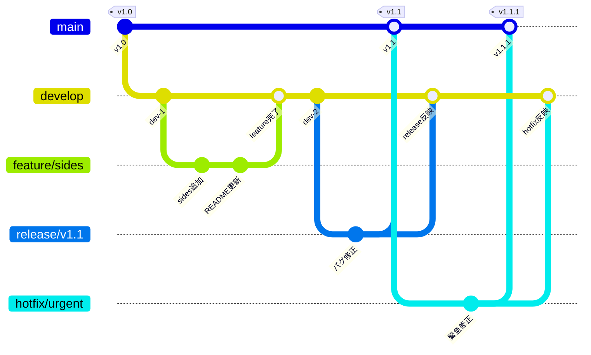

# Git Flowの全体像（5つのブランチの役割図）

## 概要

Git Flowで使われる5種類のブランチの関係と役割を示す図です。第4章のブランチ戦略の説明で使用します。

## 図



## テキスト版（スライド用）

```
main        ──●──────────────────────●──●── (本番リリース)
               \                    ↑   ↑
release         \            ──●──●/    |   (リリース準備)
                 \          /           |
develop     ──●───●──●──●──●──●─────●──/    (開発の統合)
                   \      ↑    \    ↑
feature             ●──●─/      ●──/        (機能開発)
                                ↑
hotfix      ────────────────── ●──          (緊急修正)
```

## 各ブランチの役割

| ブランチ | 役割 | 寿命 |
|---|---|---|
| main | 本番リリースの状態を保持する | 永続 |
| develop | 開発中の最新状態を統合する | 永続 |
| feature | 個別の機能を開発する | 一時的（マージ後に削除） |
| release | リリース前の最終調整を行う | 一時的（マージ後に削除） |
| hotfix | 本番の緊急バグを修正する | 一時的（マージ後に削除） |

## 補足

- Git Flowは大規模プロジェクト向けの戦略であることを伝える
- 講座ではmain + featureの2つに絞って体験すると範囲を宣言する
- GitHub FlowやGitLab Flowといった軽量な戦略もあることに触れる
