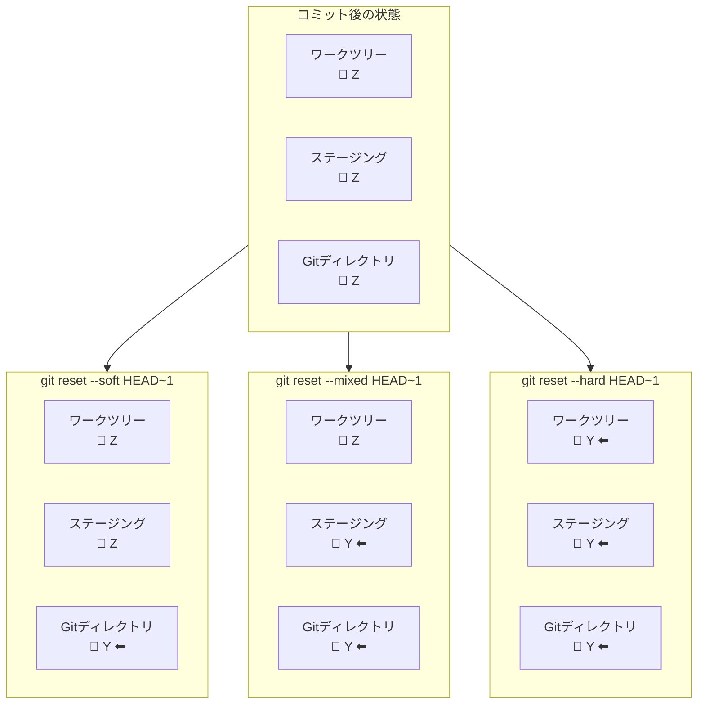

# git resetの3モードと3層構造の対応図

## 概要

`git reset` の3つのモード（--soft / --mixed / --hard）が、3層構造のどこまで巻き戻すかを示す図です。第5章で使用します。

ファイルの状態を X → Y → Z と順に更新していく例で説明します。現在は Y の状態を Z に更新する作業が完了（コミット済み）した直後です。

## 図



## テキスト版（スライド用）

```
ファイルの状態を X → Y → Z と更新。Z をコミットした直後の状態から reset すると...

  コミット後       ワークツリー     ステージング     Gitディレクトリ
  ─────────────────────────────────────────────────────────────
  （現在の状態）        Z               Z               Z
  ─────────────────────────────────────────────────────────────

  reset 実行後     ワークツリー     ステージング     Gitディレクトリ
  ─────────────────────────────────────────────────────────────
  --soft              Z               Z             Y ⬅
  --mixed             Z             Y ⬅            Y ⬅
  --hard            Y ⬅            Y ⬅            Y ⬅
  ─────────────────────────────────────────────────────────────
                                    ← 右から順に Y に戻っていく →
```

## 補足

- コミット後は3つの領域すべてが Z の状態で揃っている
- reset は Gitディレクトリ側（右）から順に Y に巻き戻していくイメージで説明する
- --soft は「コミットだけやり直し。すぐ再コミットできる」
- --mixed は「コミット＋ステージングをやり直し。git add からやり直せる」
- --hard は「全部なかったことに。変更が完全に失われるので注意」
- 講師向け：X → Y → Z の具体例として「¥1,200 → ¥1,250 → ¥1,300」のような価格変更を使うとイメージしやすい
