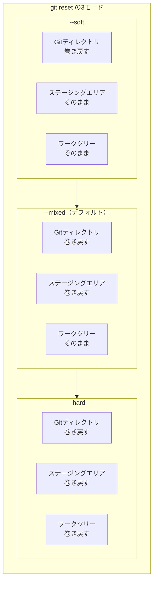

# git resetの3モードと3層構造の対応図

## 概要

`git reset` の3つのモード（--soft / --mixed / --hard）が、3層構造のどこまで巻き戻すかを示す図です。第5章で使用します。

## 図



## テキスト版（スライド用）

```
                     Gitディレクトリ   ステージングエリア   ワークツリー
                     (コミット履歴)
  ─────────────────────────────────────────────────────────────────
  --soft              巻き戻す          そのまま            そのまま
  --mixed (default)   巻き戻す          巻き戻す            そのまま
  --hard              巻き戻す          巻き戻す            巻き戻す
  ─────────────────────────────────────────────────────────────────
                     ← 影響範囲が広がる →
```

## 補足

- 「巻き戻す」領域が左から右に広がっていくイメージで説明する
- --soft は「コミットだけやり直し」、--mixed は「コミット＋ステージングをやり直し」、--hard は「全部なかったことに」と要約する
- --hard は変更が完全に失われるため、慎重に使うよう注意を促す
