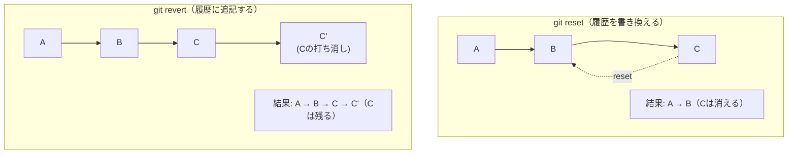
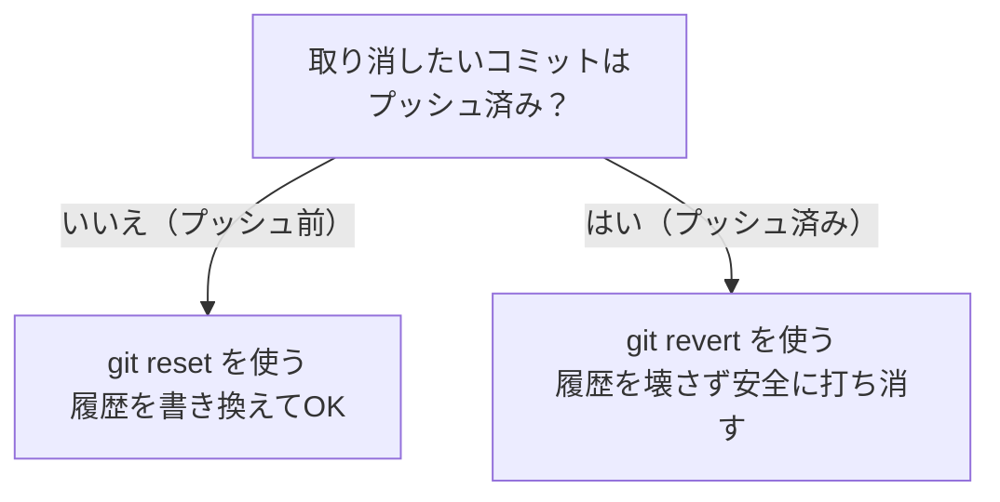

# reset vs revertの違いを示す図

## 概要

`git reset` と `git revert` の根本的な違い（履歴を書き換える vs 履歴に追記する）を示す図です。第6章で使用します。

## 図



## テキスト版（スライド用）

```
【git reset】 履歴を書き換える
  Before:  A → B → C
  After:   A → B          ← Cが履歴から消える
  用途:    プッシュ前のコミットを取り消す

【git revert】 履歴に追記する
  Before:  A → B → C
  After:   A → B → C → C' ← Cは残り、打ち消しコミットC'が追加される
  用途:    プッシュ後のコミットを安全に取り消す
```

## 使い分けの判断基準



## 補足

- reset は「なかったことにする」、revert は「打ち消す記録を残す」というイメージで説明する
- プッシュ済みかどうかが最大の判断基準であることを強調する
- reset をプッシュ済みのコミットに使うとチームメンバーとの履歴が食い違う危険がある点を注意喚起する
