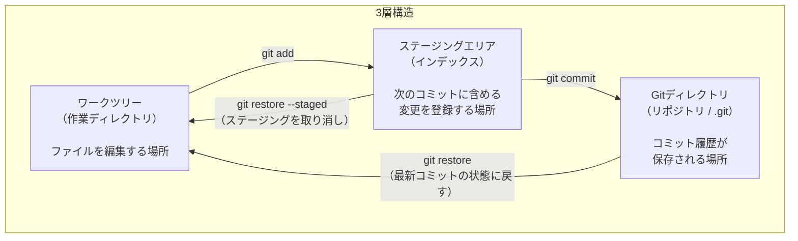

# ワークツリー・ステージングエリア・Gitディレクトリの3層構造図

## 概要

Gitにおけるファイル管理の3つの領域と、それぞれの間を移動するコマンドの関係を示す図です。第2章の導入で使用します。

## 図

## 補足

- 講師は図を示しながら「ファイルの変更は左から右に進む」と説明する
- `git status` はこの3層のどこに差分があるかを表示するコマンドであることを補足する
- `git diff` はワークツリー ↔ ステージングエリアの差分、`git diff --cached` はステージングエリア ↔ Gitディレクトリの差分であることと対応させる
