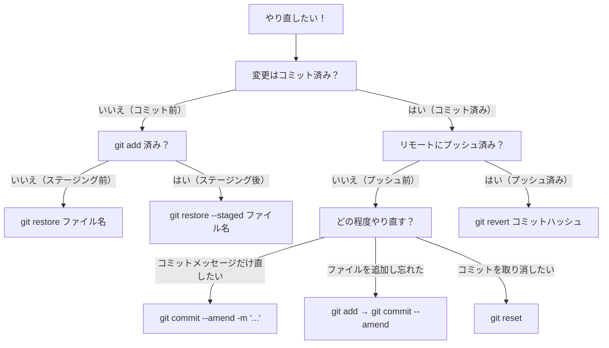

# やり直し操作リファレンスシート

Git基礎講座で学んだやり直し操作の一覧です。「間違えた！」と思ったときに、状況に応じて適切なコマンドを選べるようにまとめています。

---

## 判断フローチャート



---

## 状況別コマンド一覧

### コミット前のやり直し

| 状況 | やりたいこと | コマンド |
|---|---|---|
| ステージング前 | ワークツリーの変更を取り消したい | `git restore ファイル名` |
| ステージング後 | ステージングを取り消したい（変更はワークツリーに残る） | `git restore --staged ファイル名` |

### コミット後・プッシュ前のやり直し

| 状況 | やりたいこと | コマンド |
|---|---|---|
| メッセージの誤り | 直前のコミットメッセージを直したい | `git commit --amend -m "正しいメッセージ"` |
| ファイルの追加忘れ | 直前のコミットにファイルを追加したい | `git add ファイル名` → `git commit --amend --no-edit` |
| コミットのやり直し | コミットだけ取り消したい（変更はステージングに残る） | `git reset --soft HEAD~1` |
| コミットのやり直し | コミットとステージングを取り消したい（変更はワークツリーに残る） | `git reset --mixed HEAD~1` |
| 完全な巻き戻し | すべてを完全に巻き戻したい（変更も消える） | `git reset --hard HEAD~1` |

### プッシュ後のやり直し

| 状況 | やりたいこと | コマンド |
|---|---|---|
| プッシュ済み | 直前のコミットを安全に打ち消したい | `git revert HEAD` |
| プッシュ済み | 特定のコミットを安全に打ち消したい | `git revert コミットハッシュ` |

---

## git reset の3モード早見表

```
                     Gitディレクトリ   ステージングエリア   ワークツリー
  ─────────────────────────────────────────────────────────────────
  --soft              巻き戻す          そのまま            そのまま
  --mixed (default)   巻き戻す          巻き戻す            そのまま
  --hard              巻き戻す          巻き戻す            巻き戻す
  ─────────────────────────────────────────────────────────────────
```

- `--soft` : コミットだけやり直し。すぐ再コミットできる
- `--mixed` : コミット＋ステージングをやり直し。`git add` からやり直せる
- `--hard` : 全部なかったことに。**変更が完全に失われるので注意**

---

## reset と revert の使い分け

| | git reset | git revert |
|---|---|---|
| 動作 | 履歴を書き換える | 打ち消しコミットを追加する |
| 履歴 | 対象コミットが消える | 対象コミットは残る |
| 使える場面 | プッシュ前のみ | プッシュ前・後どちらでも |
| 推奨場面 | **プッシュ前** | **プッシュ後** |

**迷ったら：プッシュ済みなら `revert`、プッシュ前なら `reset`**

---

## コンフリクト発生時の対応

マージやrevert時にコンフリクトが発生した場合：

| やりたいこと | コマンド |
|---|---|
| コンフリクトを解消してマージを完了する | ファイルを編集 → `git add ファイル名` → `git commit` |
| マージを中止して元に戻る | `git merge --abort` |
| revertを中止して元に戻る | `git revert --abort` |

---

## 困ったときの第一歩

```bash
git status
```

何が起きているかわからないときは、まず `git status` を実行してください。現在の状態と、次に何をすべきかのヒントが表示されます。
